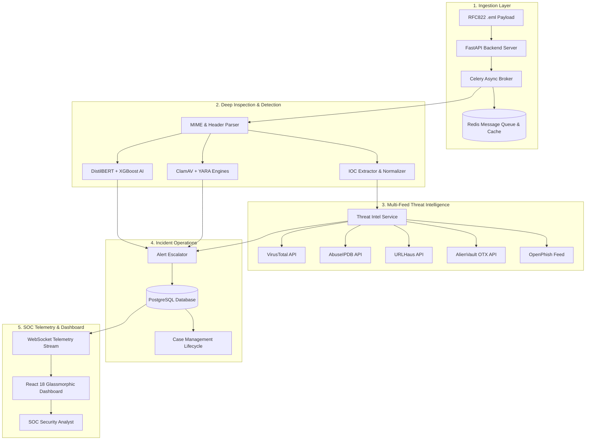

# 🛡️ CyberShield-AI-SOC

> **Enterprise Autonomous AI Email Threat Detection, Incident Response & SOC Platform**

[](https://github.com/umeshpandeysh/CyberShield-AI-SOC/actions)
[](https://github.com/umeshpandeysh/CyberShield-AI-SOC/releases/tag/v1.0.0)
[](LICENSE)
[](https://python.org)
[](https://fastapi.tiangolo.com)
[](https://reactjs.org)
[](https://typescriptlang.org)
[](https://docs.celeryq.dev)
[](https://docker.com)
[](https://kubernetes.io)

---

## 📌 Executive Summary

**CyberShield-AI-SOC** is an enterprise-grade autonomous Security Operations Center (SOC) platform engineered to detect, classify, enrich, and respond to email-borne cyber threats in real time.

It combines **DistilBERT** transformer models, **XGBoost** metadata classifiers, multi-scanner file engines (**ClamAV & YARA**), multi-provider threat intelligence feeds (**VirusTotal, AbuseIPDB, URLHaus, AlienVault OTX, OpenPhish**), **Celery+Redis** task distribution, **PostgreSQL** case tracking, and a glassmorphic **React 18** SOC dashboard.

---

## 📑 Table of Contents

- [System Architecture](#-system-architecture)
- [Feature Comparison Matrix](#-feature-comparison-matrix)
- [Module Highlights](#-module-highlights)
- [Directory Structure](#-directory-structure)
- [Quick Start Guide](#-quick-start-guide)
  - [Option A: Multi-Container Docker Stack](#option-a-multi-container-docker-stack-recommended)
  - [Option B: Local Developer Installation](#option-b-local-developer-installation)
  - [Option C: Kubernetes Deployment via Helm](#option-c-kubernetes-deployment-via-helm)
- [API Documentation & Examples](#-api-documentation--examples)
- [Security & Compliance](#-security--compliance)
- [FAQ & Troubleshooting](#-faq--troubleshooting)
- [Community & Contributing](#-community--contributing)

---

## 🏗️ System Architecture



---

## ⚡ Feature Comparison Matrix

| Feature / Capability | CyberShield-AI-SOC | Traditional SEG | Standard SIEM |
|----------------------|--------------------|-----------------|---------------|
| **Hybrid NLP + Metadata AI** | ✅ Dual DistilBERT + XGBoost | ❌ Static Rules Only | ❌ Requires Add-ons |
| **Explainable AI (XAI) Tokens** | ✅ Token Rationale Included | ❌ Black-box | ❌ Black-box |
| **Multi-Provider Threat Intel** | ✅ 5 Feeds with CircuitBreaker | ⚠️ Single Feed | ⚠️ Plugin Dependent |
| **Async Task Queue & Fallback** | ✅ Celery + Sync Fallback | ❌ Synchronous Only | ⚠️ Variable |
| **Integrated Incident Case Drawer** | ✅ Built-in with Notes & Evidence | ❌ Export Required | ⚠️ External Ticketing |
| **Real-time WebSockets Stream** | ✅ Included (`/ws/notifications`) | ❌ Polling Only | ⚠️ Extension Required |
| **PDF/Text Executive Export** | ✅ Built-in Report Generator | ❌ Basic Logs Only | ⚠️ Premium Module |

---

## 🧩 Directory Structure

```
CyberShield-AI-SOC/
├── backend/                  # FastAPI Application Core
│   ├── app/
│   │   ├── adapters/         # Domain Adapters & Services
│   │   │   ├── routes/       # REST API Endpoints (Auth, Ingest, Alerts, Cases, ThreatIntel, Admin, Settings, Metrics, Reports)
│   │   │   ├── ai_service.py # DistilBERT & XGBoost Engine
│   │   │   ├── celery_app.py # Celery Task App
│   │   │   ├── threat_intel_providers.py # Provider Abstraction & CircuitBreaker
│   │   │   └── threat_intel_service.py   # Aggregation & Escalation Engine
│   │   ├── domain/           # SQLAlchemy Models & Schemas
│   │   └── infra/            # DB Session & Configuration
│   └── requirements.txt
├── frontend/                 # React 18 + Vite + TypeScript SOC Dashboard
│   ├── src/
│   │   ├── App.tsx           # Main Dashboard Views
│   │   ├── api.ts            # REST Client
│   │   ├── types.ts          # TypeScript Interfaces
│   │   └── index.css         # Glassmorphism Dark Theme
│   ├── package.json
│   └── vite.config.ts
├── deploy/                   # Infrastructure Manifests
│   ├── helm/                 # Kubernetes Helm Chart
│   ├── k8s/                  # Kubernetes Yaml Deployment
│   └── monitoring/           # Prometheus Scraper Config
├── samples/                  # RFC822 .eml Test Email Files
│   ├── phishing_sample.eml
│   └── benign_sample.eml
├── scripts/                  # Automated DB Backup/Restore Tool
│   └── backup_restore.sh
├── tests/                    # 88 Pytest Unit & Integration Tests
├── docker-compose.prod.yml   # Multi-container Production Stack
├── Dockerfile                # Production Container Build Spec
├── CHANGELOG.md              # Historical Changelog
└── RELEASE_NOTES_v1.0.md     # Official v1.0.0 Release Notes
```

---

## 🚀 Quick Start Guide

### Option A: Multi-Container Docker Stack (Recommended)

```bash
# Clone the repository
git clone https://github.com/umeshpandeysh/CyberShield-AI-SOC.git
cd CyberShield-AI-SOC

# Start production containers (PostgreSQL, Redis, FastAPI Backend, Celery Worker)
docker-compose -f docker-compose.prod.yml up -d --build

# Verify container health status
docker-compose -f docker-compose.prod.yml ps
```
- **Interactive REST Swagger Docs**: `http://localhost:8000/docs`
- **React SOC Dashboard**: `http://localhost:3000`

---

### Option B: Local Developer Installation

<details>
<summary>Click to expand Local Developer Setup instructions</summary>

#### 1. Backend Setup
```bash
# Create virtual environment
python -m venv venv
source venv/bin/activate  # Windows: venv\Scripts\activate

# Install dependencies
pip install -r backend/requirements.txt

# Start Redis container
docker run -d -p 6379:6379 redis:7-alpine

# Run backend API
uvicorn app.main:app --reload --port 8000
```

#### 2. Frontend Setup
```bash
cd frontend

# Install node modules
npm install

# Run TypeScript typecheck
npm run typecheck

# Start dev server
npm run dev
```
</details>

---

### Option C: Kubernetes Deployment via Helm

<details>
<summary>Click to expand Kubernetes & Helm deployment guide</summary>

```bash
# Create namespace
kubectl create namespace cybershield-soc

# Deploy via Helm chart
helm install cybershield ./deploy/helm -n cybershield-soc

# Monitor pod status
kubectl get pods -n cybershield-soc
```
</details>

---

## 📖 API Documentation & Examples

<details>
<summary>Click to expand API curl examples</summary>

### 1. Authenticate & Obtain Access Token
```bash
curl -X POST "http://localhost:8000/api/v1/auth/login" \
  -H "Content-Type: application/json" \
  -d '{"email": "analyst@cybershield.io", "password": "Password123!"}'
```

### 2. Async RFC822 Email Ingestion
```bash
curl -X POST "http://localhost:8000/api/v1/ingest/email/async" \
  -H "Authorization: Bearer <TOKEN>" \
  -F "file=@samples/phishing_sample.eml"
```

### 3. Single IOC Threat Intel Enrichment
```bash
curl -X GET "http://localhost:8000/api/v1/threat-intel/ioc/http%3A%2F%2Ffakebank-login.com%2Fverify" \
  -H "Authorization: Bearer <TOKEN>"
```

### 4. Create Incident Case
```bash
curl -X POST "http://localhost:8000/api/v1/cases" \
  -H "Authorization: Bearer <TOKEN>" \
  -H "Content-Type: application/json" \
  -d '{
    "title": "Account Takeover Phishing Campaign",
    "severity": "Critical",
    "description": "Credential harvesting attack targeting finance department."
  }'
```
</details>

---

## ❓ FAQ & Troubleshooting

<details>
<summary>Click to expand FAQ & Troubleshooting</summary>

#### Q: How does the system handle Redis offline state?
A: The ingestion route automatically falls back to synchronous execution when Redis is unreachable, ensuring zero lost email telemetry.

#### Q: How are third-party Threat Intel API keys configured?
A: Third-party API keys (VirusTotal, AbuseIPDB, OTX) can be configured in `.env` or `config.py`. If API keys are unconfigured, provider fallback mocking executes automatically.
</details>

---

## 🤝 Community & Contributing

Contributions are welcome! Please read [.github/CONTRIBUTING.md](.github/CONTRIBUTING.md) and [.github/CODE_OF_CONDUCT.md](.github/CODE_OF_CONDUCT.md).

---

## 📄 License

This project is licensed under the **MIT License** - see the [LICENSE](LICENSE) file for details.
