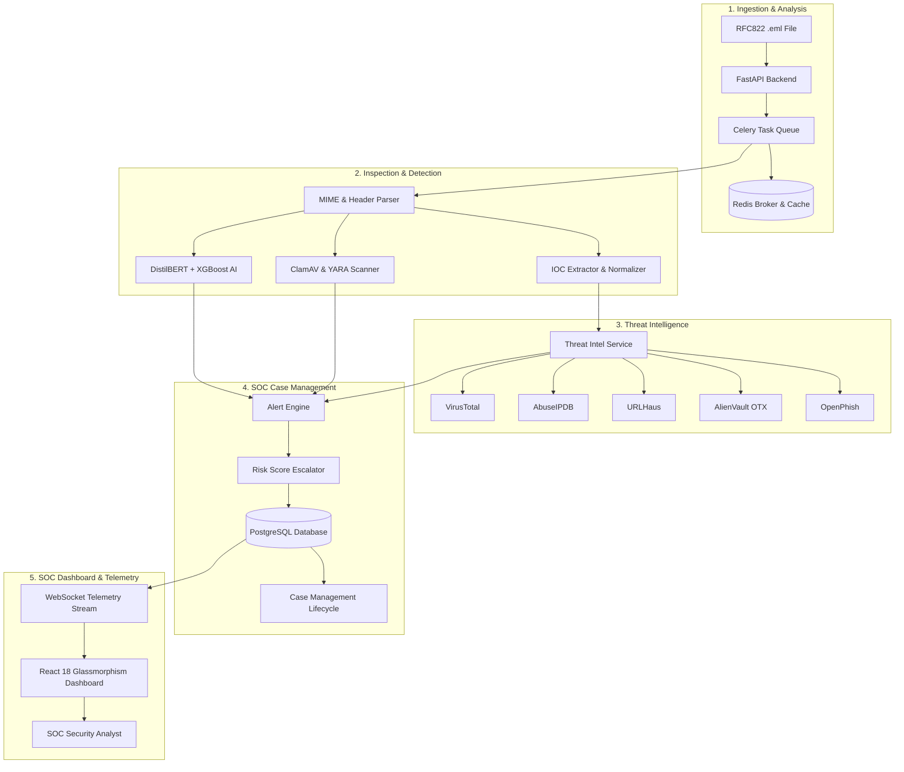

# 🛡️ CyberShield-AI-SOC

> **Autonomous AI-Driven Email Threat Detection, Incident Response & SOC Platform**

[](https://github.com/umeshpandeysh/CyberShield-AI-SOC/actions)
[](LICENSE)
[](https://python.org)
[](https://fastapi.tiangolo.com)
[](https://reactjs.org)
[](https://docker.com)

---

## 📌 Executive Overview

**CyberShield-AI-SOC** is an enterprise-ready, autonomous Security Operations Center (SOC) platform designed for modern security teams. It automatically ingests RFC822 `.eml` emails, parses MIME structures, extracts IOC indicators (URLs, IPs, domains, hashes), runs malware and signature scans (ClamAV & YARA), evaluates threats using a hybrid **DistilBERT + XGBoost** AI engine, enriches indicators via multi-provider threat intelligence (**VirusTotal, AbuseIPDB, URLHaus, OTX, OpenPhish**), and orchestrates incident triage via a glassmorphic React dashboard.

---

## 🏗️ System Architecture



---

## ✨ Core Feature Highlights

| Module | Features & Capabilities |
|--------|-------------------------|
| **Email Parsing** | RFC822 MIME parser, body extraction, URL parsing, attachment disk sandbox, deduplication. |
| **IOC Extraction** | Regex classifier for URLs, domains, IPv4, IPv6, email addresses, MD5, SHA1, SHA256. |
| **Threat Scanning** | **ClamAV** malware scanning + **YARA** custom signature matching. |
| **AI Classification** | **DistilBERT** NLP + **XGBoost** metadata model with Explainable AI (XAI) token extraction. |
| **Async Pipeline** | **Celery + Redis** task distribution, exponential retries, dead-letter failure handling. |
| **Case Management** | Incident lifecycle (`Open` to `Closed`), severity levels, analyst notes, evidence collection, timeline. |
| **Threat Intelligence** | **VirusTotal**, **AbuseIPDB**, **URLHaus**, **OTX**, **OpenPhish** with `CircuitBreaker` resilience. |
| **Real-time Telemetry** | `WebSocket /ws/notifications` live alert stream & async task progress monitoring. |
| **Analytics & Reports** | 7-day threat trend, top targets, top malicious URLs, executive PDF report exporter. |
| **SOC Dashboard** | Dark-mode glassmorphic React 18 dashboard with interactive triage drawers and admin controls. |

---

## 🚀 Quick Start & Installation

### Option 1: Docker Compose Production Stack (Recommended)

```bash
# 1. Clone the repository
git clone https://github.com/umeshpandeysh/CyberShield-AI-SOC.git
cd CyberShield-AI-SOC

# 2. Start the multi-container stack
docker-compose -f docker-compose.prod.yml up -d --build

# 3. Check status
docker-compose -f docker-compose.prod.yml ps
```
- **Backend Swagger API**: `http://localhost:8000/docs`
- **React SOC Dashboard**: `http://localhost:3000`

---

### Option 2: Local Developer Setup

#### Backend Setup
```bash
# Create virtual environment
python -m venv venv
source venv/bin/activate  # On Windows: venv\Scripts\activate

# Install dependencies
pip install -r backend/requirements.txt

# Start Redis & PostgreSQL (or use Docker)
docker run -d -p 6379:6379 redis:7-alpine

# Start Backend API
uvicorn app.main:app --reload --port 8000
```

#### Frontend Setup
```bash
cd frontend

# Install packages
npm install

# Run TypeScript type check
npm run typecheck

# Start development server
npm run dev
```

---

## 📖 API Usage & Examples

### 1. Authenticate & Obtain JWT Token
```bash
curl -X POST "http://localhost:8000/api/v1/auth/login" \
  -H "Content-Type: application/json" \
  -d '{"email": "analyst@cybershield.io", "password": "Password123!"}'
```

### 2. Async Email Ingestion (`.eml` upload)
```bash
curl -X POST "http://localhost:8000/api/v1/ingest/email/async" \
  -H "Authorization: Bearer <YOUR_JWT_TOKEN>" \
  -F "file=@samples/phishing_sample.eml"
```

### 3. Threat Intelligence IOC Enrichment
```bash
curl -X GET "http://localhost:8000/api/v1/threat-intel/ioc/http%3A%2F%2Ffakebank-login.com%2Fverify" \
  -H "Authorization: Bearer <YOUR_JWT_TOKEN>"
```

### 4. Create SOC Incident Case
```bash
curl -X POST "http://localhost:8000/api/v1/cases" \
  -H "Authorization: Bearer <YOUR_JWT_TOKEN>" \
  -H "Content-Type: application/json" \
  -d '{
    "title": "Account Takeover Phishing Campaign",
    "severity": "Critical",
    "description": "Suspicious login link targeting corporate accounts."
  }'
```

---

## ☸️ Kubernetes & Production Deployment

### Kubernetes Deployment via Helm
```bash
# Create namespace
kubectl create namespace cybershield-soc

# Deploy using Helm chart
helm install cybershield ./deploy/helm -n cybershield-soc

# Monitor pod deployment
kubectl get pods -n cybershield-soc
```

### Database Backup & Recovery
```bash
# Automated database backup
./scripts/backup_restore.sh backup

# Restore database from snapshot
./scripts/backup_restore.sh restore ./backups/cybershield_backup_YYYYMMDD_HHMMSS.sql.gz
```

---

## 🧪 Testing & Verification

Run the comprehensive unit and integration test suite:

```bash
# Run backend pytest suite (88 tests)
pytest

# Run Python linting
flake8 backend

# Run frontend type check and production build
cd frontend && npm run typecheck && npm run build
```

---

## 📄 License

This project is licensed under the **MIT License** - see the [LICENSE](LICENSE) file for details.
