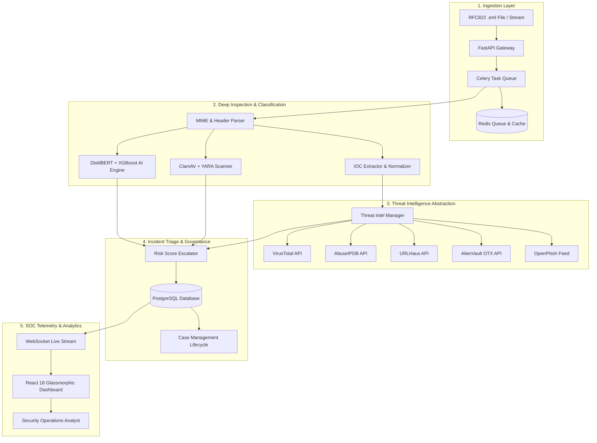

<div align="center">

# 🛡️ CyberShield-AI-SOC

### Autonomous AI-Powered Email Threat Detection, Incident Response & SOC Operations Platform

[](https://github.com/umeshpandeysh/CyberShield-AI-SOC/actions)
[](https://github.com/umeshpandeysh/CyberShield-AI-SOC/releases/tag/v1.0.0)
[](LICENSE)
[](https://python.org)
[](https://fastapi.tiangolo.com)
[](https://reactjs.org)
[](https://typescriptlang.org)
[](https://docs.celeryq.dev)
[](https://redis.io)
[](https://postgresql.org)
[](https://docker.com)
[](https://kubernetes.io)

[Key Features](#-key-features) • [System Architecture](#-system-architecture) • [Quick Start](#-quick-start) • [API Specification](#-api-specification) • [Deployment](#-deployment) • [Contributing](#-contributing)

</div>

---

## 📌 Executive Overview

**CyberShield-AI-SOC** is a production-grade, end-to-end Security Operations Center (SOC) platform built for high-throughput, automated email threat ingestion, analysis, and response. It combines modern NLP transformers (**DistilBERT**), structural metadata classifiers (**XGBoost**), multi-engine signature scanning (**ClamAV & YARA**), multi-feed threat intelligence enrichment (**VirusTotal, AbuseIPDB, URLHaus, AlienVault OTX, OpenPhish**), distributed task queues (**Celery + Redis**), and incident case management into a unified glassmorphic **React 18** SOC dashboard.

### Why CyberShield-AI-SOC?
- 🚀 **Zero-Latency Ingestion**: Non-blocking asynchronous processing via Celery queues with automatic fallback to synchronous execution during queue degradation.
- 🧠 **Explainable AI (XAI)**: Hybrid fusion scoring model delivering transparent threat classification with highlighted token rationales.
- ⚡ **Resilient Threat Intel**: Circuit-breaker-protected provider queries with Redis caching to avoid redundant API quota usage.
- 📊 **Enterprise Incident Lifecycle**: Full incident case workflow with evidence tracking, analyst notes, timeline audit trails, and executive PDF exports.

---

## 🏗️ System Architecture



---

## 📊 Feature Comparison Matrix

| Feature / Metric | CyberShield-AI-SOC | Legacy Email Gateway (SEG) | Standard SIEM Platform |
|------------------|--------------------|----------------------------|------------------------|
| **AI Threat Engine** | ✅ Hybrid DistilBERT + XGBoost | ❌ Static Rules Only | ⚠️ Basic Correlation |
| **Explainable AI (XAI)** | ✅ Token Feature Extraction | ❌ Black-box Decision | ❌ None |
| **Multi-Provider Threat Intel** | ✅ 5 Feeds with CircuitBreaker | ⚠️ Single Proprietary Feed | ⚠️ Plugin Dependent |
| **Async Processing Queue** | ✅ Celery + Redis | ❌ Synchronous Only | ⚠️ Variable |
| **Integrated Incident Drawer** | ✅ Built-in Notes, Evidence & Timeline | ❌ External Ticketing | ⚠️ Additional License |
| **Real-time Telemetry Stream** | ✅ Native WebSockets (`/ws/notifications`) | ❌ Polling Only | ⚠️ Extension Required |
| **Executive PDF Export** | ✅ Native Report Generator | ❌ Basic Text Logs | ⚠️ Premium Module |

---

## 🧩 Module Breakdown

<details>
<summary><b>1. Email Ingestion & MIME Parser</b></summary>
Parses RFC822 MIME payloads, extracts body text/HTML, separates attachments, extracts hyperlinks, computes SHA-256 hashes, and deduplicates against RFC822 <code>Message-ID</code>.
</details>

<details>
<summary><b>2. IOC Extraction & Normalization</b></summary>
Regex classifier and validator extracting URLs, domains, IPv4, IPv6, email addresses, MD5, SHA1, and SHA256 hashes into PostgreSQL relational schemas.
</details>

<details>
<summary><b>3. Threat Scanning Engine</b></summary>
Executes <b>ClamAV</b> daemon scanning for malware binaries and <b>YARA</b> signature rules for header/body heuristics.
</details>

<details>
<summary><b>4. AI Threat Classification</b></summary>
Dual-model classifier fusing NLP body features (DistilBERT) and header metadata (XGBoost) into a final risk score ($R = 0.6 \cdot P_{\text{text}} + 0.4 \cdot P_{\text{meta}}$).
</details>

<details>
<summary><b>5. Asynchronous Processing Pipeline</b></summary>
Celery worker pipeline backed by Redis for high-throughput background processing with exponential backoff retries and dead-letter handling.
</details>

<details>
<summary><b>6. SOC Case Management</b></summary>
Incident investigation workspace with severity levels, status transitions, analyst notes, evidence collection, timeline audit logs, and Role-Based Access Control (RBAC).
</details>

<details>
<summary><b>7. Threat Intelligence Enrichment</b></summary>
Pluggable feed enrichment abstraction (VirusTotal, AbuseIPDB, URLHaus, AlienVault OTX, OpenPhish) with `CircuitBreaker` fault tolerance and Redis caching.
</details>

<details>
<summary><b>8. Telemetry & WebSockets</b></summary>
Real-time notification stream (`/ws/notifications`) broadcasting alert triggers and processing task updates.
</details>

---

## 📁 Repository Directory Structure

```
CyberShield-AI-SOC/
├── backend/                  # FastAPI Application Backend
│   ├── app/
│   │   ├── adapters/         # API Routes & Service Adapters
│   │   │   ├── routes/       # Auth, Ingest, Alerts, Cases, ThreatIntel, Admin, Settings, Metrics, Reports, WebSockets
│   │   │   ├── ai_service.py # DistilBERT & XGBoost Machine Learning Service
│   │   │   ├── celery_app.py # Celery Task Queue Setup
│   │   │   ├── threat_intel_providers.py # CircuitBreaker & Pluggable Feeds
│   │   │   └── threat_intel_service.py   # Aggregation & Alert Escalation Engine
│   │   ├── domain/           # SQLAlchemy Models & Schemas
│   │   └── infra/            # Database Connection Pooling & Config
│   └── requirements.txt
├── frontend/                 # React 18 + Vite + TypeScript Dashboard
│   ├── src/
│   │   ├── App.tsx           # Full Dashboard Application Workspace
│   │   ├── api.ts            # REST Client with JWT Authentication
│   │   ├── types.ts          # TypeScript Schema Definitions
│   │   └── index.css         # Glassmorphism Dark Theme Styling
│   ├── package.json
│   └── vite.config.ts
├── deploy/                   # Infrastructure & DevOps Declarations
│   ├── helm/                 # Kubernetes Helm Chart
│   ├── k8s/                  # Kubernetes Deployment Manifests
│   └── monitoring/           # Prometheus Telemetry Configuration
├── samples/                  # RFC822 Email Sample Files (.eml)
│   ├── phishing_sample.eml
│   └── benign_sample.eml
├── scripts/                  # PostgreSQL Automated Backup & Restore Script
│   └── backup_restore.sh
├── tests/                    # 88 Unit & Integration Pytest Cases
├── docker-compose.prod.yml   # Production Multi-Container Compose Stack
└── Dockerfile                # Production Container Build Specification
```

---

## 🚀 Quick Start Guide

### Option 1: Production Multi-Container Docker Stack (Recommended)

```bash
# Clone the repository
git clone https://github.com/umeshpandeysh/CyberShield-AI-SOC.git
cd CyberShield-AI-SOC

# Start the complete production stack (PostgreSQL, Redis, FastAPI Backend, Celery Worker)
docker-compose -f docker-compose.prod.yml up -d --build

# Verify service health
docker-compose -f docker-compose.prod.yml ps
```
- **REST API OpenAPI Docs**: `http://localhost:8000/docs`
- **React SOC Dashboard**: `http://localhost:3000`

---

### Option 2: Local Developer Setup

<details>
<summary>Click to expand Local Developer Installation instructions</summary>

#### Backend Setup
```bash
# Create Python 3.11 virtual environment
python -m venv venv
source venv/bin/activate  # On Windows: venv\Scripts\activate

# Install dependencies
pip install -r backend/requirements.txt

# Start Redis broker
docker run -d -p 6379:6379 redis:7-alpine

# Launch FastAPI application server
uvicorn app.main:app --reload --port 8000
```

#### Frontend Setup
```bash
cd frontend

# Install node dependencies
npm install

# Run TypeScript type check
npm run typecheck

# Start Vite dev server
npm run dev
```
</details>

---

### Option 3: Kubernetes & Helm Deployment

<details>
<summary>Click to expand Kubernetes & Helm deployment guide</summary>

```bash
# Create namespace
kubectl create namespace cybershield-soc

# Deploy via Helm chart
helm install cybershield ./deploy/helm -n cybershield-soc

# Inspect cluster pods
kubectl get pods -n cybershield-soc
```
</details>

---

## 📖 API Usage & Curl Examples

<details>
<summary>Click to expand API curl code snippets</summary>

### 1. Authenticate Analyst & Obtain JWT Token
```bash
curl -X POST "http://localhost:8000/api/v1/auth/login" \
  -H "Content-Type: application/json" \
  -d '{"email": "analyst@cybershield.io", "password": "Password123!"}'
```

### 2. Async Email Ingestion (`.eml` upload)
```bash
curl -X POST "http://localhost:8000/api/v1/ingest/email/async" \
  -H "Authorization: Bearer <YOUR_JWT_TOKEN>" \
  -F "file=@samples/phishing_sample.eml"
```

### 3. Query Threat Intelligence for Indicator
```bash
curl -X GET "http://localhost:8000/api/v1/threat-intel/ioc/http%3A%2F%2Ffakebank-login.com%2Fverify" \
  -H "Authorization: Bearer <YOUR_JWT_TOKEN>"
```

### 4. Create Incident Investigation Case
```bash
curl -X POST "http://localhost:8000/api/v1/cases" \
  -H "Authorization: Bearer <YOUR_JWT_TOKEN>" \
  -H "Content-Type: application/json" \
  -d '{
    "title": "Phishing Campaign Targeting Finance Team",
    "severity": "Critical",
    "description": "User reported suspicious login link with executable attachment payload."
  }'
```
</details>

---

## 🧪 Testing & Verification

```bash
# Run complete backend pytest suite (88 tests passing 100%)
pytest

# Run Python code quality linting
flake8 backend

# Run frontend TypeScript type checking and production build
cd frontend && npm run typecheck && npm run build
```

---

## 🔒 Security & Compliance

- **No Hardcoded Secrets**: All credentials dynamically configured via `.env` or system settings.
- **RBAC Enforced**: Distinct permissions for `Admin`, `Analyst_L1`, and `Analyst_L2`.
- **Immutable Audit Logging**: Every administrative action, triage decision, and case modification creates an `AuditLog` entry.

---

## 🤝 Community & Contributing

Contributions are welcome! Please review [.github/CONTRIBUTING.md](.github/CONTRIBUTING.md), [.github/CODE_OF_CONDUCT.md](.github/CODE_OF_CONDUCT.md), and [.github/SECURITY.md](.github/SECURITY.md).

---

## 📄 License

This project is open source and available under the [MIT License](LICENSE).
