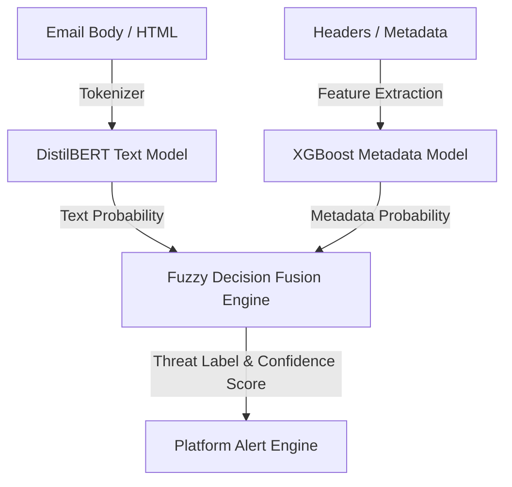

# AI Architecture & Pipeline Specification

The AI Engine for **CyberShield-AI-SOC** uses a hybrid machine learning design combining deep learning Natural Language Processing (NLP) models for unstructured text, and structured classifiers for metadata evaluation.

---

## 1. Multi-Model Architecture

### 1.1 Text Classification Model: DistilBERT-Phish
* **Base Architecture**: `distilbert-base-uncased` (Hugging Face Transformers).
* **Classification Task**: Binary classification (Phishing vs. Clean).
* **Input**: Tokenized email body content (truncated to 512 tokens max).
* **Rationale**: DistilBERT provides 97% of BERT's performance with a 40% reduction in size and 60% faster inference times, allowing it to run within our 3-second SLA.

### 1.2 Metadata Classification Model: MetaShield (XGBoost)
* **Base Architecture**: Gradient-Boosted Decision Trees (XGBoost Classifier).
* **Classification Task**: Binary classification (Malicious Headers/Links vs. Clean).
* **Features Extracted**:
  * `spf_status` (Encodings: PASS=0, FAIL=1, NONE=2, SOFTFAIL=3)
  * `dkim_status` (Encodings: PASS/FAIL/NONE)
  * `dmarcs_status` (Encodings: PASS/FAIL/NONE)
  * `url_count` (Integer)
  * `suspicious_tld_count` (Integer, e.g. `.zip`, `.ru`, `.cc`)
  * `sender_recipient_similarity` (Levenshtein distance float)
  * `attachment_count` (Integer)
  * `attachment_exe_extension` (Binary flag)

### 1.3 Decision Fusion
The final risk score $R$ is computed using a weighted decision:
$$R = w_{\text{text}} \cdot P_{\text{text}} + w_{\text{meta}} \cdot P_{\text{meta}}$$
* Default weights: $w_{\text{text}} = 0.6$, $w_{\text{meta}} = 0.4$.

---

## 2. Preprocessing & Feature Engineering

1. **HTML Sanitization**: HTML emails are parsed to strip script tags and isolate visible text payloads. URLs are extracted and replaced with token placeholders (`[URL_TOKEN]`) to prevent model overfitting to specific domains.
2. **Text Normalization**: Unicode normalization, case folding (lowercasing), and punctuation grouping.
3. **Levensthein Similarity**: Computes similarity index between the sender domain (e.g., `paypal-update.com`) and target brand names (e.g., `paypal.com`) to catch typosquatting.

---

## 3. Training & Evaluation Pipeline

* **Dataset Sourcing**:
  * Clean dataset: Enron Email Dataset, SpamAssassin clean subset.
  * Threat dataset: PhishTank corpora, custom collected phishing mail runs.
* **Train/Val/Test Split**: 80% / 10% / 10% stratified split.
* **Loss Function**: Weighted Cross-Entropy Loss to counter dataset imbalance (since phishing is relatively scarce in general traffic).
* **Optimization**: AdamW optimizer ($lr=5e-5$) with linear scheduler warmup.
* **Evaluation Metrics**: Precision, Recall, and F1-score. Given the business cost, we optimize for **Recall** (minimizing false negatives) while maintaining a baseline of **Precision > 95%**.

---

## 4. Serving & Inference Flow

1. The Celery worker POSTs the payload to the AI Engine container at `/api/v1/classify`.
2. The AI Engine runs preprocessing, extracts header vectors, and evaluates the BERT tokenizer.
3. Batching: The inference API uses queue-based batching (grouping requests over 50ms intervals) to maximize GPU utilization under high-throughput states.
4. **Explainable AI (XAI)**: We implement a token weight visualization by computing gradients of the output prediction relative to input embeddings. This highlights the top 5 words that contributed most to the phishing classification score and saves them in the database for SOC analyst review.

---

## 5. Feedback Loop & Retraining

* **Analyst Action**: When a SOC analyst marks an alert as `RESOLVED_FALSE_POSITIVE` or manually flags a missed email, the system inserts the corrected record into a `retraining_buffer` database partition.
* **Retraining Cycle**: Every weekend, an automated cron job checks if the retraining buffer exceeds 1,000 samples. If so, a SageMaker/local training job triggers, fine-tunes the models, runs safety checks against a golden validation test suite, and saves the new weights to the `/models/` directory for rolling updates.
