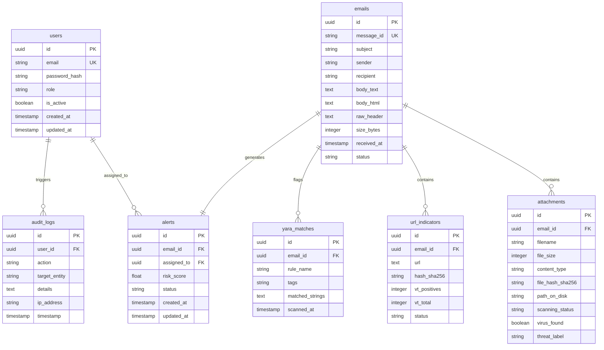

# Database Design Specification

This document details the relational schema design for **PostgreSQL** and key-value structures for **Redis** caching and task management.

---

## 1. Entity-Relationship Diagram (ERD)

---

## 2. Table Definitions (PostgreSQL)

### 2.1 Table: `users`
Stores administrative and analyst user accounts.

| Column | Data Type | Constraints | Description |
| ------ | --------- | ----------- | ----------- |
| `id` | `UUID` | `PRIMARY KEY`, Default `gen_random_uuid()` | Unique identifier. |
| `email` | `VARCHAR(255)` | `UNIQUE`, `NOT NULL` | User email address. |
| `password_hash` | `VARCHAR(255)` | `NOT NULL` | Bcrypt password hash. |
| `role` | `VARCHAR(50)` | `NOT NULL` | RBAC role: `Admin`, `Analyst_L1`, `Analyst_L2`. |
| `is_active` | `BOOLEAN` | Default `TRUE` | Active status control. |
| `created_at` | `TIMESTAMP` | Default `NOW()` | Timestamp of record creation. |
| `updated_at` | `TIMESTAMP` | Default `NOW()` | Timestamp of last modification. |

* **Indexes**:
  * `idx_users_email` (B-Tree on `email` for login performance).

### 2.2 Table: `emails`
Stores metadata and text payloads of all ingested emails.

| Column | Data Type | Constraints | Description |
| ------ | --------- | ----------- | ----------- |
| `id` | `UUID` | `PRIMARY KEY` | Unique identifier. |
| `message_id` | `VARCHAR(255)` | `UNIQUE`, `NOT NULL` | The RFC822 message ID. |
| `subject` | `VARCHAR(998)` | — | The email subject line. |
| `sender` | `VARCHAR(320)` | `NOT NULL` | Sender's email address. |
| `recipient` | `VARCHAR(320)` | `NOT NULL` | Recipient's email address. |
| `body_text` | `TEXT` | — | Extracted plain text body. |
| `body_html` | `TEXT` | — | Extracted raw HTML body. |
| `raw_header` | `TEXT` | `NOT NULL` | Full raw headers list. |
| `size_bytes` | `INTEGER` | — | Total size in bytes. |
| `received_at` | `TIMESTAMP` | `NOT NULL` | Timestamp from headers. |
| `status` | `VARCHAR(50)` | `NOT NULL` | Processing status: `Queued`, `Analyzing`, `Completed`, `Failed`. |

* **Indexes**:
  * `idx_emails_sender` (B-Tree on `sender`).
  * `idx_emails_received_at` (B-Tree DESC on `received_at` for timeline sorting).

### 2.3 Table: `attachments`
Details file attachments extracted from email payloads.

| Column | Data Type | Constraints | Description |
| ------ | --------- | ----------- | ----------- |
| `id` | `UUID` | `PRIMARY KEY` | Unique identifier. |
| `email_id` | `UUID` | `FOREIGN KEY` references `emails(id) ON DELETE CASCADE` | Associated email. |
| `filename` | `VARCHAR(255)` | `NOT NULL` | Filename. |
| `file_size` | `INTEGER` | `NOT NULL` | Size in bytes. |
| `content_type` | `VARCHAR(100)` | — | MIME content type. |
| `file_hash_sha256`| `CHAR(64)` | `NOT NULL` | SHA-256 binary hash. |
| `path_on_disk` | `VARCHAR(512)` | — | Local path to file (sandbox). |
| `scanning_status` | `VARCHAR(50)` | `NOT NULL` | Status: `Pending`, `Scanned`, `Skipped`, `Failed`. |
| `virus_found` | `BOOLEAN` | Default `FALSE` | Result of ClamAV scan. |
| `threat_label` | `VARCHAR(255)`| — | Malware signature name. |

* **Indexes**:
  * `idx_attachments_hash` (B-Tree on `file_hash_sha256`).
  * `idx_attachments_email_id` (B-Tree on `email_id`).

### 2.4 Table: `url_indicators`
Stores hyperlinks extracted from bodies.

| Column | Data Type | Constraints | Description |
| ------ | --------- | ----------- | ----------- |
| `id` | `UUID` | `PRIMARY KEY` | Unique identifier. |
| `email_id` | `UUID` | `FOREIGN KEY` references `emails(id) ON DELETE CASCADE` | Associated email. |
| `url` | `TEXT` | `NOT NULL` | Extracted URL string. |
| `hash_sha256` | `CHAR(64)` | `NOT NULL` | URL SHA-256 hash. |
| `vt_positives` | `INTEGER` | Default `0` | VirusTotal detections. |
| `vt_total` | `INTEGER` | Default `0` | Total engines checked. |
| `status` | `VARCHAR(50)` | `NOT NULL` | Status: `Clean`, `Suspicious`, `Malicious`, `Unrated`. |

* **Indexes**:
  * `idx_urls_hash` (B-Tree on `hash_sha256` for lookup speed).

### 2.5 Table: `yara_matches`
Tracks custom signatures triggered on the email header or body.

| Column | Data Type | Constraints | Description |
| ------ | --------- | ----------- | ----------- |
| `id` | `UUID` | `PRIMARY KEY` | Unique identifier. |
| `email_id` | `UUID` | `FOREIGN KEY` references `emails(id) ON DELETE CASCADE` | Associated email. |
| `rule_name` | `VARCHAR(255)` | `NOT NULL` | Name of the matched YARA rule. |
| `tags` | `VARCHAR(255)` | — | Tags attached to the rule. |
| `matched_strings` | `JSONB` | — | Exact matching offsets and string values. |
| `scanned_at` | `TIMESTAMP` | Default `NOW()` | Scan execution timestamp. |

### 2.6 Table: `alerts`
Integrates AI scores, YARA hits, and file scans into a triage entity.

| Column | Data Type | Constraints | Description |
| ------ | --------- | ----------- | ----------- |
| `id` | `UUID` | `PRIMARY KEY` | Unique identifier. |
| `email_id` | `UUID` | `FOREIGN KEY` references `emails(id)`, `UNIQUE` | One-to-one with email. |
| `assigned_to` | `UUID` | `FOREIGN KEY` references `users(id) ON DELETE SET NULL` | Assigned analyst. |
| `risk_score` | `FLOAT` | `NOT NULL` | Computed score (0.0 to 1.0). |
| `status` | `VARCHAR(50)` | `NOT NULL`, Default `'OPEN'` | Status: `OPEN`, `INVESTIGATING`, `RESOLVED_QUARANTINED`, `RESOLVED_FALSE_POSITIVE`. |
| `created_at` | `TIMESTAMP` | Default `NOW()` | Generation timestamp. |
| `updated_at` | `TIMESTAMP` | Default `NOW()` | Modification timestamp. |

* **Indexes**:
  * `idx_alerts_status` (B-Tree on `status`).
  * `idx_alerts_risk` (B-Tree DESC on `risk_score`).

### 2.7 Table: `audit_logs`
Mandatory immutable trail tracking analyst triage actions.

| Column | Data Type | Constraints | Description |
| ------ | --------- | ----------- | ----------- |
| `id` | `UUID` | `PRIMARY KEY` | Unique identifier. |
| `user_id` | `UUID` | `FOREIGN KEY` references `users(id) ON DELETE SET NULL` | Performing user. |
| `action` | `VARCHAR(100)` | `NOT NULL` | e.g. `QUARANTINE_EMAIL`, `LOGIN`, `UPDATE_USER`. |
| `target_entity` | `VARCHAR(100)` | `NOT NULL` | DB table name or entity identifier. |
| `details` | `TEXT` | — | Old value/New value changes representation. |
| `ip_address` | `VARCHAR(45)` | — | IP address of performing user (IPv4/IPv6). |
| `timestamp` | `TIMESTAMP` | Default `NOW()` | Execution time. |

---

## 3. Key-Value Cache & Queue Schemas (Redis)

### 3.1 Session Token Registry
Blacklisting revoked JWTs.
* **Key**: `blacklist:{token_jti}`
* **Value**: `1`
* **TTL**: Remaining token lifetime (e.g. 3600 seconds).

### 3.2 Celery Queue Structure
* **Key**: `celery` (List containing serialized task payloads).
* **Broker Format**: JSON payloads detailing task name, UUID, and arguments (`email_id`).
