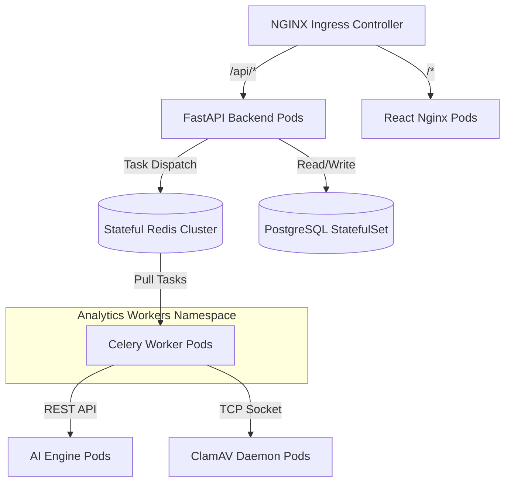

# Deployment Architecture Specification

This document details the target runtime environments for the **CyberShield-AI-SOC** platform, covering Docker configuration, Kubernetes production design, observability, and CI/CD pipelines.

---

## 1. Containerization Architecture (Docker)

To minimize vulnerability profiles and build footprint, all containerized microservices follow these standards:
* **Multi-Stage Builds**: Separate compile-time tools (compilers, build headers) from runtime environments, resulting in production images ~80% smaller.
* **Non-Root Execution**: Explicitly define and run services under custom user accounts (e.g. `USER appuser` in Dockerfiles) with numeric IDs (UID `10001`) to protect hosts against container-escape exploits.
* **Base Images**: Standardize on minimal, hardened distributions:
  * Python apps: `python:3.11-slim` (Debian-based, patched regularly).
  * Node.js apps: `node:20-alpine` (Alpine-based, minimal size).
  * Infrastructure: Alpine-based official images (`postgres:15-alpine`, `redis:7-alpine`).

---

## 2. Production Deployment Blueprint (Kubernetes)

For enterprise scaling and resilience, the application is deployed into **Kubernetes (EKS / GKE / AKS)**:



### 2.1 Pod Autoscaling
* **Horizontal Pod Autoscalers (HPAs)**:
  * **Backend & AI Engine Pods**: Autoscale based on average CPU utilization exceeding 70% or average request rates.
  * **Celery Worker Pods**: Autoscale dynamically based on custom Prometheus metrics tracking the queue depth of the Redis task broker.

### 2.2 Ingress Routing & SSL Termination
* **Ingress**: Managed via NGINX Ingress Controller.
* **SSL Termination**: Handled at Ingress using cert-manager automated certificates (Let's Encrypt), terminating SSL and forwarding traffic over HTTP/1.1 to backends.

---

## 3. Observability & Monitoring Stack

Our observability stack integrates Metrics, Logs, and Traces (the three pillars):

```text
=============================================================================
Pillar      | Tooling            | Ingestion & Visualization Route
=============================================================================
Metrics     | Prometheus         | Scrapes '/metrics' -> Grafana Dashboards
Logs        | Promtail / Loki    | stdout JSON logs -> Grafana Log Panel
Traces/Error| Sentry             | In-app SDK logs errors directly to Sentry Cloud
=============================================================================
```

### 3.1 Prometheus Metric Collection
All backend and AI service processes expose a `/metrics` endpoint (using Prometheus Python SDK) monitoring:
* `http_requests_total` (counter, by path and status).
* `email_ingestion_processing_time_seconds` (histogram).
* `redis_queue_depth` (gauge, number of waiting queue tasks).
* `inference_latency_seconds` (histogram, tracking model speeds).

---

## 4. CI/CD Automation Pipeline (GitHub Actions)

The pipeline automates quality controls, security audits, container builds, and rolling updates to Kubernetes clusters:

```mermaid
gantt
    title CI/CD Deployment Lifecycle
    dateFormat  X
    axisFormat %s
    section Test & Scan
    Code Checkout        :active, des1, 0, 5
    Linting & Static Checks :active, des2, 5, 15
    Unit & Integration Tests :active, des3, 15, 30
    OWASP Dependency Scan :active, des4, 30, 45
    section Build & Push
    Docker Image Build   : des5, 45, 60
    Trivy Image Scan     : des6, 60, 75
    Push to ECR/GHCR     : des7, 75, 85
    section Deploy
    Kustomize Manifests  : des8, 85, 95
    ArgoCD / Kubectl Rollout : des9, 95, 100
```


