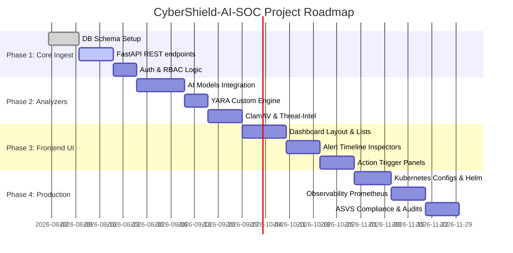

# Development Roadmap & Testing Strategy

This roadmap details the phases of implementation, testing methodology, and the final repository layout once development is complete.

---

## 1. Phased Development Roadmap

The development of the platform is scheduled across 4 distinct execution phases:



---

## 2. Testing Strategy

We enforce the **Testing Pyramid** model to ensure code safety, maintainability, and regression prevention.

```text
       /\
      /  \       E2E Tests (10% - Playwright / Cypress UI runs)
     /----\
    /      \     Integration Tests (20% - Pytest API endpoints / Celery pipelines)
   /--------\
  /          \   Unit Tests (70% - Pytest unit logic / React component tests)
 /____________\
```

### 2.1 Unit Tests (70% Coverage Target)
* **Backend**: Written using `pytest`. Test core use cases and domain entities in isolation by mocking database gateways.
* **AI Engine**: Verify data preprocessors, tokenizer truncations, and classifier probability tensor output shapes.
* **Frontend**: Unit test React components using `Vitest` and `React Testing Library` to verify button events, loaders, and state controls.

### 2.2 Integration Tests (20% Coverage Target)
* **API Endpoints**: Run live API tests using `httpx.AsyncClient` against a localized, test-configured Docker PostgreSQL database.
* **Task Pipelines**: Verify that dispatching an email ID to Redis triggers workers, runs the scanners, and correctly updates the database tables.

### 2.3 End-to-End (E2E) Tests (10% Coverage Target)
* **User Journeys**: Utilize `Playwright` to simulate a SOC Analyst logging into the dashboard, navigating to an alert, inspecting headers, adding a comment, and clicking "Quarantine Sender".

### 2.4 Security Scanning
* **Static Application Security Testing (SAST)**: Use `Bandit` on Python code and `ESLint Security Plugin` on JavaScript to scan for insecure coding patterns during CI runs.
* **Dependency Scanning**: Run `pip-audit` and `npm audit` to catch vulnerable packages.
* **Dynamic Scans (DAST)**: Run weekly OWASP ZAP baseline scans against the running dev/staging web dashboard.

---

## 3. Post-Implementation Repository Structure

Once all code modules are implemented, the repository layout will represent the following structure:

```text
CyberShield-AI-SOC/
├── frontend/
│   ├── src/
│   │   ├── assets/         # CSS and global asset files
│   │   ├── components/     # AlertCards, StatsPanel, HeaderInspector
│   │   ├── pages/          # Login, Dashboard, IncidentView, Settings
│   │   ├── services/       # api.ts, ws.ts
│   │   ├── App.tsx
│   │   └── main.tsx
├── backend/
│   ├── app/
│   │   ├── domain/         # email.py, alert.py, user.py
│   │   ├── usecases/       # ingest_email.py, triage_alert.py
│   │   ├── adapters/       # db_repo.py, celery_tasks.py
│   │   ├── infra/          # db_session.py, config.py
│   │   └── main.py
├── ai-engine/
│   ├── models/             # distilbert_weights/
│   ├── core/               # preprocess.py, classifier.py
│   └── main.py
├── services/
│   ├── yara/               # scan_yara.py
│   ├── clamav/             # scan_clamav.py
│   └── threatintel/        # vt_lookup.py
├── tests/
│   ├── unit/
│   │   ├── test_usecases.py
│   │   └── test_ai_preprocessors.py
│   ├── integration/
│   │   ├── test_endpoints.py
│   │   └── test_celery_pipeline.py
│   └── e2e/
│       └── test_analyst_flow.py
├── docker/
│   ├── Dockerfile.backend
│   ├── Dockerfile.ai
│   ├── Dockerfile.frontend
│   └── nginx.conf
├── docs/                   # (10 Architecture Documents stored here)
```
