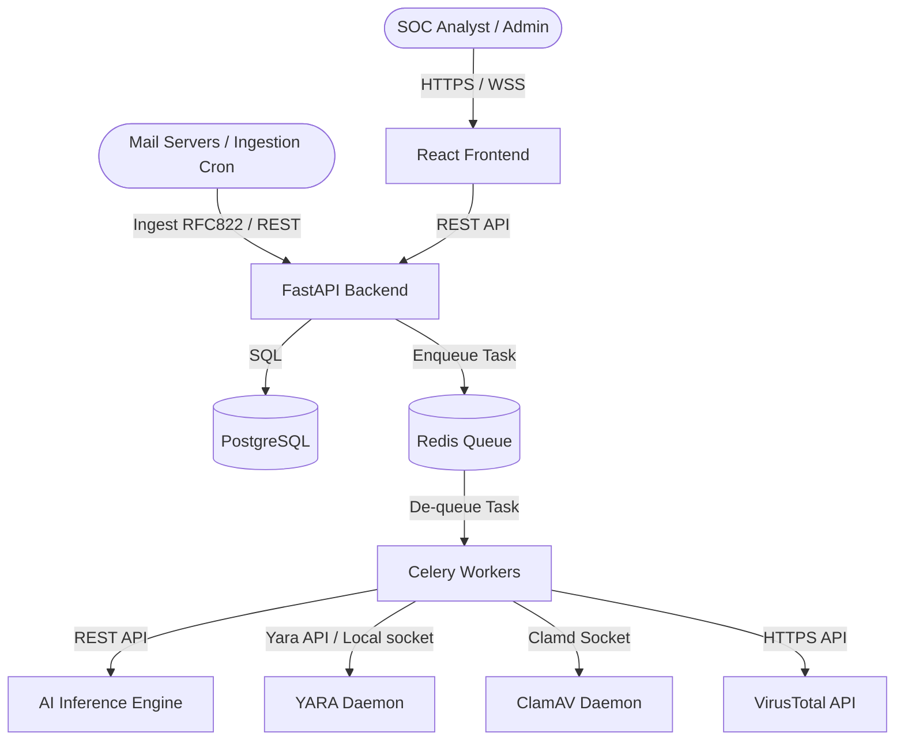

# Project Architecture Document (PAD)

## 1. High-Level Architecture Overview

**CyberShield-AI-SOC** is built on a **modular microservice architecture** using a decoupled domain design. The system isolates the user interface, APIs, deep learning logic, and signature scanners to ensure failure containment, rapid scaling, and technology-appropriate compute allocation (e.g., GPU nodes for AI, CPU nodes for standard backends).



---

## 2. Architectural Design Patterns

### 2.1 Domain-Driven Design (DDD)
The backend codebase is divided into bounded contexts, isolating business rules:
* **Ingestion Bounded Context**: Handles raw emails, sanitizes HTML, extracts attachments, and hashes files.
* **Analysis Bounded Context**: Orchestrates AI, YARA, ClamAV, and Threat-Intel jobs.
* **Incident Bounded Context**: Manages alerts, audit logs, and analyst case progression.

### 2.2 Clean Architecture
Inside each microservice (particularly `backend` and `ai-engine`), we enforce a strict separation of concerns:
1. **Domain Layer (Entities & Core Rules)**: Defines the core logic models (e.g., `Email`, `Alert`, `Attachment`) independent of databases, web frameworks, or third-party client libraries.
2. **Application Layer (Use Cases)**: Orchestrates the flow of data to and from entities, expressing features (e.g., `IngestEmailUseCase`, `TriageAlertUseCase`).
3. **Interface Adapters (Controllers, Gateways, Presenters)**: Translates data from HTTP, CLI, or message queues into forms acceptable to the application layer (e.g., SQLAlchemy repositories, FastAPI routes).
4. **Infrastructure Layer (External Frameworks)**: Realizations of interfaces (databases, web servers, docker host files).

---

## 3. Project Directory Architecture

The repository organization details how code is segregated to facilitate Clean Architecture:

```text
CyberShield-AI-SOC/
├── frontend/               # React UI
│   ├── src/
│   │   ├── components/     # Reusable components
│   │   ├── context/        # State Management (Auth, Theme)
│   │   ├── pages/          # Layouts (Dashboard, CaseList, Investigation)
│   │   ├── services/       # API call handlers
│   │   └── types/          # TypeScript interfaces
├── backend/                # FastAPI Application
│   ├── app/
│   │   ├── domain/         # Core business interfaces and entities
│   │   ├── usecases/       # Core business logic orchestrators
│   │   ├── adapters/       # DB repos, API clients, controllers
│   │   ├── infra/          # Config, database connections, migrations
│   │   └── main.py         # Entry point
├── ai-engine/              # Python PyTorch/Transformers app
│   ├── models/             # PyTorch weights & configurations
│   ├── core/               # Feature preprocessing & tokenizers
│   └── main.py             # Inference API server
├── services/               # Scan drivers
│   ├── yara_scanner/       # YARA engine integration
│   ├── clamav_scanner/     # Local clamd library wrapper
│   └── threat_intel/       # VirusTotal/AbuseIPDB client SDKs
```

---

## 4. Cross-Cutting Workflows & Inter-service Communication

The system implements two distinct communication channels:
1. **Synchronous RPC (REST)**: Used for user authentication, fetching analyst dashboard details, case management state updates, and quick triage actions.
2. **Asynchronous Orchestration (Redis + Workers)**: Used for email analysis pipelines. Since YARA scans, ClamAV, and VirusTotal requests take variable times, the backend drops incoming emails into Redis, allowing Celery workers to parse, run models, enrich via threat intel, write alert entities, and push real-time notifications to the frontend over WebSockets.
