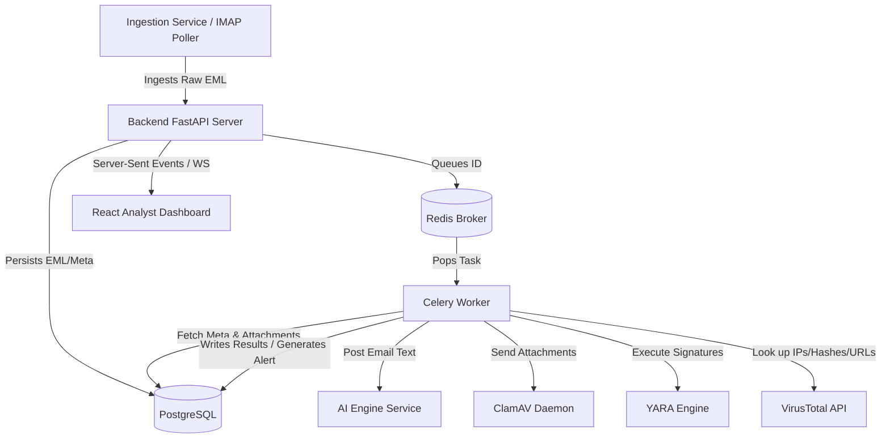

# System Architecture & Services

This document details the responsibilities, input/output structures, interfaces, and failure strategies for every microservice within the **CyberShield-AI-SOC** platform.

---

## 1. Backend API Service

* **Responsibility**: Orchestrates administrative access, provides APIs for the frontend dashboard, validates authentication tokens, handles REST-based ingestion, writes database entities, and broadcasts live WebSocket alert notifications.
* **Inputs**:
  * HTTP Requests (REST payloads, multipart form data for `.eml` uploads).
  * WebSockets connection requests.
* **Outputs**:
  * HTTP Responses (JSON alerts, user contexts, diagnostic payloads).
  * WebSocket JSON push payloads.
* **Internal APIs**:
  * `/api/v1/auth/login` (REST)
  * `/api/v1/ingest/email` (REST POST - EML upload)
  * `/api/v1/alerts` (REST GET - paginated case feed)
  * `/api/v1/alerts/{id}/triage` (REST PATCH - status transition)
  * `/api/v1/ws/alerts` (WebSocket endpoint)
* **Dependencies**:
  * PostgreSQL (Relational persistence)
  * Redis (Task queueing & session registry)
* **Failure Handling**:
  * **Database Outage**: Return `503 Service Unavailable` with clean error schema; log trace. Implement connection pooling retries.
  * **Redis Outage**: Store raw email objects locally in PostgreSQL and label them `Pending_Queue`. Execute a background synchronization cron to enqueue them as soon as Redis reconnects.

---

## 2. Ingestion Service / IMAP Poller

* **Responsibility**: Listens for incoming email data, periodically polls corporate mailboxes (using IMAP over TLS), parses attachments and body texts, and submits them to the Backend API.
* **Inputs**:
  * IMAP inbox polls.
  * Cron scheduler ticks.
* **Outputs**:
  * Multi-part forms containing raw mail strings and metadata forwarded to `/api/v1/ingest/email`.
* **APIs**:
  * Cron-based background routines.
* **Dependencies**:
  * Backend API Service.
  * Target mailboxes (Office 365, Gmail API, SMTP).
* **Failure Handling**:
  * **IMAP Auth Failure**: Stop polling, register high-severity audit warning, email system administrator, and retry authentication with exponential backoff.
  * **Backend API Unreachable**: Cache parsed EML data in local filesystem under `data/ingest_cache/` until API is reachable, preventing data loss.

---

## 3. Celery Async Task Worker

* **Responsibility**: Executes computation-heavy or high-latency processing (running YARA matches, communicating with the AI Engine, calling third-party APIs, and invoking ClamAV).
* **Inputs**:
  * Task messages from Redis queue containing `email_id`.
* **Outputs**:
  * Written analysis results stored in PostgreSQL.
  * Dispatched system notifications.
* **APIs**:
  * Reads/writes database and interfaces with internal HTTP/TCP sockets.
* **Dependencies**:
  * PostgreSQL (for database states).
  * AI Engine (via HTTP/REST).
  * ClamAV / YARA (via local execution/TCP sockets).
  * External Threat-Intel APIs (VirusTotal).
* **Failure Handling**:
  * **External API Timeout (e.g. VirusTotal)**: Execute tasks with Celery retry options (`max_retries=3`, `default_retry_delay=60s`).
  * **ClamAV Service Dead**: Fail the specific attachment scan step, flag attachment status as `Scan_Failed` in DB, proceed with YARA and AI scans to avoid blocking the pipeline, and alert administrators.

---

## 4. AI Inference Engine

* **Responsibility**: Serves pre-trained Natural Language Processing models (Hugging Face Transformers / PyTorch) to compute threat probabilities for email texts.
* **Inputs**:
  * JSON HTTP POST request containing `{ "email_id": "string", "body": "string", "headers": "string" }`.
* **Outputs**:
  * JSON body: `{ "is_phishing": boolean, "phishing_probability": float, "is_spam": boolean, "spam_probability": float, "explanations": [ { "token": "string", "weight": float } ] }`.
* **APIs**:
  * `/api/v1/classify` (POST)
  * `/api/v1/health` (GET)
* **Dependencies**:
  * Serialized weights loaded from `/app/models/`.
* **Failure Handling**:
  * **Model Weights Missing**: Crash container on startup to notify orchestrator immediately.
  * **Out-of-Memory (OOM) / Heavy Load**: Scale replicas. If request fails, return default safe classification scores (`phishing_probability: 0.0`, `is_phishing: false`) with flag `classification_status: "Degraded"` so workers do not block, ensuring the pipeline continues.

---

## 5. Threat Intelligence & Scanner Services (ClamAV & YARA)

* **Responsibility**:
  * **ClamAV**: Performs binary matching on extracted email attachment buffers to find viruses, trojans, and worms.
  * **YARA Engine**: Scans text payloads and header sequences for custom regex-based indicator matches.
* **Inputs**:
  * **ClamAV**: File buffers sent via TCP stream to local clamd socket.
  * **YARA**: String payloads evaluated against loaded rulesets.
* **Outputs**:
  * **ClamAV**: Scan response (`OK`, `FOUND: Win.Trojan.Generic`).
  * **YARA**: Array of matching rules and metadata tags.
* **APIs**:
  * Clamd network protocol (TCP 3310).
  * In-process Python YARA parser bindings.
* **Dependencies**:
  * Local filesystem (for loading YARA rules).
  * ClamAV database updates (freshclam).
* **Failure Handling**:
  * **Stale ClamAV Signatures**: Implement weekly automated cron jobs updating signatures via `freshclam`. Log warnings if signatures are older than 7 days.
  * **YARA Compilation Error**: Validate all rules against a parser script before reloading the engine. If compilation fails, log detailed errors and revert to the last working ruleset.
