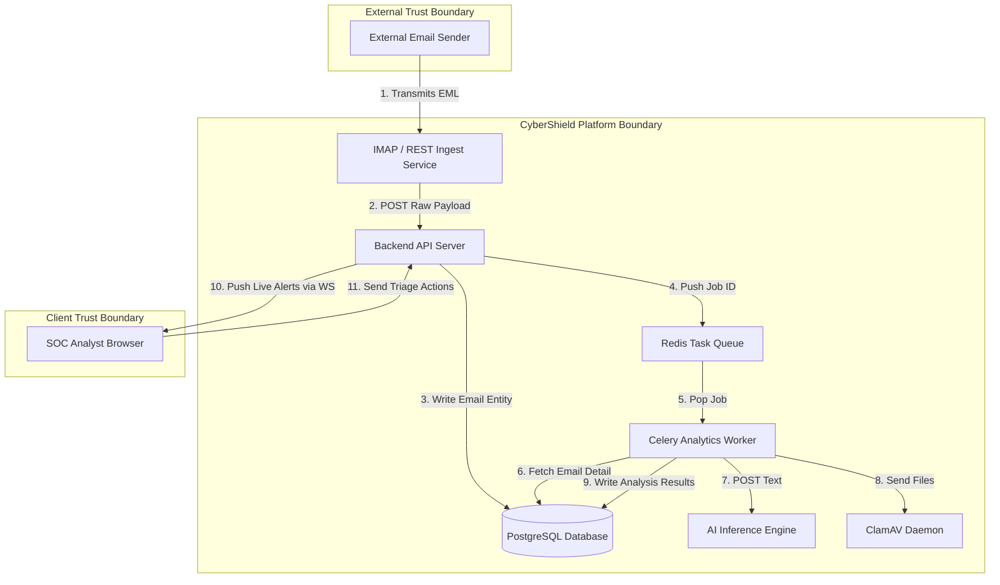

# Threat Model Specification

This threat model outlines the security bounds, potential vulnerabilities, data flows, and mitigations for **CyberShield-AI-SOC** using the **STRIDE** methodology.

---

## 1. Data Flow Diagram (DFD - Level 1)

This DFD shows trust boundaries (demarcated by double lines) and data flows across different subsystems.

---

## 2. STRIDE Threat Analysis

### 2.1 Spoofing
* **Threat**: Malicious actor spoofs a legitimate client IP address or bypasses ingestion API keys to inject fake emails, triggering false alert storms.
* **Mitigation**: Implement robust IP block/safelisting at the API gateway layer and require signed API keys with SHA-256 validation for the REST Ingest service.

### 2.2 Tampering
* **Threat**: An attacker uploads custom, corrupted `.eml` files designed to exploit buffer overflows in the parser or corrupt model tokenizers.
* **Mitigation**: Run ingestion parsers in isolated scratch memory environments with restricted CPU/Memory allocation limits. Implement input sanitization that strips control characters from raw strings before forwarding to the AI Engine.

### 2.3 Repudiation
* **Threat**: A rogue SOC Analyst deletes case files or ignores critical alerts, then denies taking action.
* **Mitigation**: Require write-only database auditing (`audit_logs`) tracking every single mutation with timestamps, target values, executing user ids, and source IP addresses. Restrict SQL UPDATE and DELETE privileges on the audit log table.

### 2.4 Information Disclosure
* **Threat**: Unauthenticated users query alerts containing sensitive employee PII or internal email content.
* **Mitigation**: Implement strict Role-Based Access Control (RBAC). All alert data endpoints must require a valid JWT. Enable column-level encryption for the database fields holding the raw body and HTML text.

### 2.5 Denial of Service (DoS)
* **Threat**: An attacker floods the ingestion endpoint with massive emails, filling up disk storage or exhausting workers.
* **Mitigation**: Enforce client rate-limits in Redis (token bucket). Restrict maximum upload size of EML payloads to 10MB. Run background cleaners to purge raw `.eml` caches older than 30 days.

### 2.6 Elevation of Privilege
* **Threat**: L1 SOC Analyst gains access to Admin API configurations or YARA upload features.
* **Mitigation**: Enforce endpoint authorization checks matching security claims in JWTs against roles before processing administrative operations.

---

## 3. Risk Assessment Matrix

We utilize the DREAD framework (Damage, Reproducibility, Exploitability, Affected Users, Discoverability) to score threats from 1 (Low) to 10 (Critical):

| ID | STRIDE | Threat Description | Score (D-R-E-A-D) | Risk Level | Mitigation |
| -- | ------ | ------------------ | ----------------- | ---------- | ---------- |
| **T01** | Spoofing | Spoofed ingest payload injection | 8 - 9 - 8 - 7 - 8 | **High** | API gateway key authentication & IP safelisting |
| **T02** | Tampering | SQL injection in triage comments | 9 - 5 - 4 - 8 - 4 | **Medium**| Parameterized SQL queries via SQLAlchemy |
| **T03** | Repudiation | Erasure of incident logs | 7 - 3 - 3 - 6 - 3 | **Low** | Read/Write constraints on audit tables |
| **T04** | Info Disc | Leakage of email body contents | 9 - 8 - 7 - 9 - 7 | **High** | Columns encryption (AES-256) & RBAC checks |
| **T05** | DoS | Redis queue starvation | 8 - 8 - 9 - 8 - 8 | **High** | Client-level rate limits & queue depth monitoring |
| **T06** | Elevation | Analyst accessing Admin config | 9 - 7 - 6 - 8 - 6 | **High** | Verify claims on every router handler |
